# 🌊🩺 River Forecasting & Breast Cancer AI

> An AI competition project combining river forecasting with medical image classification and lesion segmentation.

## 1. Project Overview

This project addresses two independent machine-learning problems:

1. **Rhine River Forecasting:** Predict river-related target values from historical and available input data, including probabilistic forecasts at multiple quantiles.
2. **Breast Cancer Analysis:** Analyze breast ultrasound images to classify them as `normal`, `benign`, or `malignant`, and identify lesion regions through image segmentation.

The two problems use different datasets, preprocessing pipelines, model architectures, and evaluation procedures. They share a common objective: producing reliable predictions that satisfy the competition's submission format and evaluation criteria.

### Competition structure

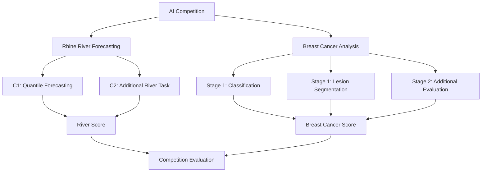

*Note: The exact C2 and Stage 2 implementations should be documented according to the final competition specification.*

---

## 2. Problem 1 — Rhine River Forecasting

### 2.1 Problem statement

River forecasting is a predictive modelling task in which a model learns relationships between available observations and future or otherwise unobserved target values.

The main challenge is to produce predictions that are accurate across different conditions rather than simply minimizing average error.

For the C1 forecasting task, the workflow produces predictions for approximately 9,400 test rows, with four required quantile predictions per row.

### 2.2 Proposed solution

The forecasting pipeline follows these stages:

1. Load the training and test datasets.
2. Inspect column types, missing values, target distributions, and time-related variables.
3. Separate input features from target values.
4. Construct training and validation datasets using a split appropriate for the temporal structure.
5. Train quantile regression models.
6. Evaluate validation error and check the ordering of predicted quantiles.
7. Generate predictions for every test row.
8. Assemble the required submission file and validate its structure.

### River forecasting architecture

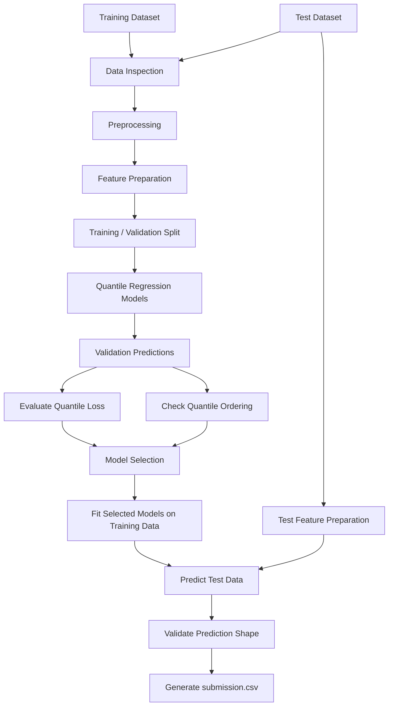

### 2.3 Quantile regression

Unlike ordinary regression, which predicts a single central estimate, quantile regression predicts different points of a target distribution.

For example:

* A lower quantile represents a lower predicted outcome.
* A middle quantile represents a central predicted outcome.
* An upper quantile represents a higher predicted outcome.

For a quantile level \(q\), the pinball loss is:

$$
L_q(y,\hat y)=
\begin{cases}
q(y-\hat y), & y\geq \hat y\\
(1-q)(\hat y-y), & y<\hat y
\end{cases}
$$

Here, \(y\) is the observed value and \(\hat y\) is the predicted quantile.

The loss penalizes underprediction and overprediction differently, depending on the quantile level.

### Quantile prediction workflow

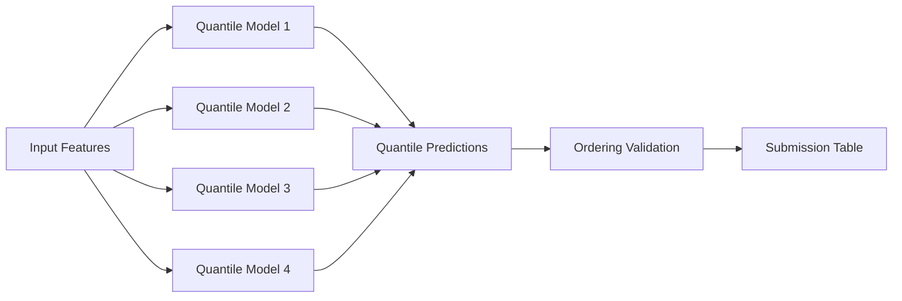

The four quantile levels must match those specified by the competition. Predictions should also be checked for quantile crossing, where a lower quantile exceeds a higher one.

### 2.4 River model evaluation

The evaluation process should examine:

* Validation quantile loss.
* Performance across different time periods or river conditions.
* Missing and non-finite predictions.
* Quantile crossing.
* Prediction distribution and extreme values.
* Correct row alignment between the test dataset and submission.

Validation must reflect the intended prediction setting. For time-dependent data, a chronological split is generally more appropriate than a random split.

### 2.5 C2 extension

The exact C2 target and model are not specified in this README. Its implementation should be documented separately once the task definition is confirmed.

The intended architecture is:

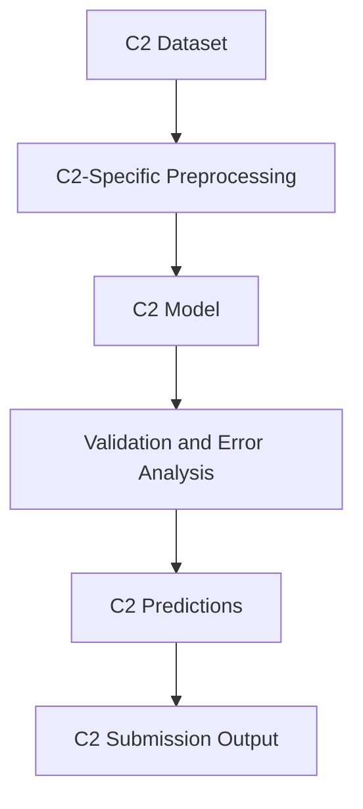

---

## 3. Problem 2 — Breast Cancer Analysis

### 3.1 Problem statement

Breast ultrasound images contain visual patterns that can help distinguish normal tissue, benign lesions, and malignant lesions.

The task has two complementary objectives:

**Classification:** Estimate the probability that an image belongs to each of three classes.

**Segmentation:** Predict the spatial region corresponding to a lesion, represented by a binary mask.

Classification answers *what category does this image belong to?* Segmentation answers *where is the lesion located?*

### 3.2 Classification labels

| Class       | Meaning                                   |
| ----------- | ----------------------------------------- |
| `normal`    | No lesion identified for the normal class |
| `benign`    | Benign lesion                             |
| `malignant` | Malignant lesion                          |

The classifier should output three probabilities per image:

$$
P(\text{normal})+
P(\text{benign})+
P(\text{malignant})=1
$$

These probabilities must be mapped to the exact image identifiers and class rows required by the competition.

### 3.3 Breast cancer architecture

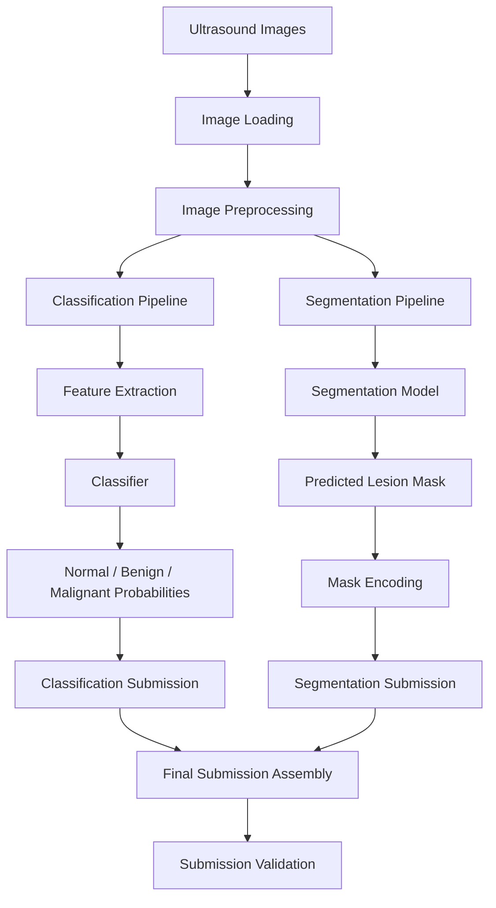

### 3.4 Classification solution

The current classification experiments use image-derived features and a classical machine-learning pipeline.

The workflow is:

1. Load the image metadata and labels.
2. Extract numerical features from the ultrasound images.
3. Create training and validation partitions.
4. Train a multiclass classifier.
5. Generate out-of-fold predictions for evaluation.
6. Produce class probabilities for the test images.
7. Map probabilities to the correct class order and submission identifiers.

The class order used in the current experiments is:

```text
0 = normal
1 = benign
2 = malignant
```

This mapping must remain consistent throughout training, validation, and submission generation.

### Classification workflow

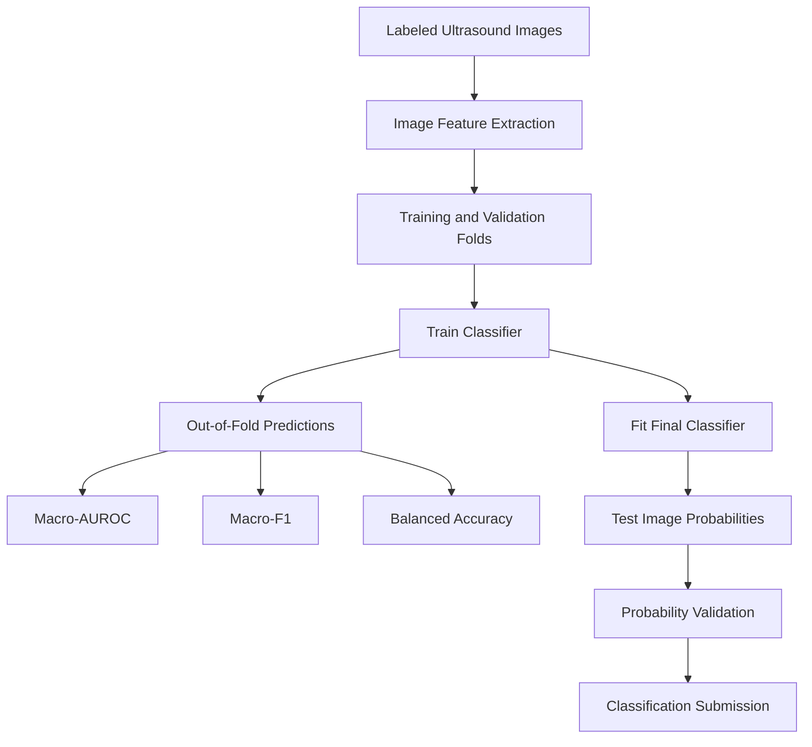

The classification pipeline should be evaluated with metrics that reflect all three classes. Accuracy alone can conceal poor performance on minority classes.

### 3.5 Lesion segmentation solution

Segmentation is a pixel-level prediction task. The model produces a mask in which each pixel indicates whether it belongs to the lesion.

The general workflow is:

1. Load training images and their ground-truth masks.
2. Apply consistent image and mask preprocessing.
3. Train a segmentation model using paired images and masks.
4. Generate masks for the test images.
5. Convert predicted masks to the competition's required representation.
6. Validate the encoded masks before submission.

A U-Net-style architecture is one possible approach.

### U-Net-style segmentation architecture

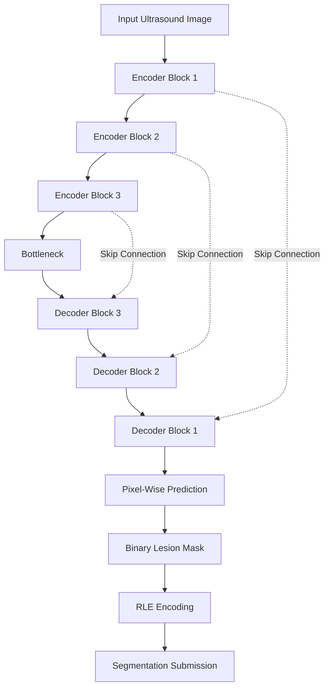

The encoder extracts increasingly abstract image features. The decoder reconstructs spatial information, while skip connections help preserve details needed for accurate lesion boundaries.

**Important:** This diagram describes the intended U-Net-style architecture. The actual model used in a particular experiment must be verified against its implementation.

### 3.6 Run-length encoding (RLE)

Some segmentation competitions require masks to be submitted as a sequence of run-length values rather than as image files.

RLE represents consecutive foreground pixels through their starting positions and lengths.

The encoding procedure must use the exact flattening order, indexing convention, and mask dimensions expected by the competition.


A valid segmentation submission should preserve the correct image identifier, use the required encoding convention, and handle empty masks according to the competition rules.

---

## 4. Breast Cancer Evaluation

The competition evaluates classification and segmentation using several complementary metrics.

| Metric            | Purpose                                                                    |
| ----------------- | -------------------------------------------------------------------------- |
| Macro-AUROC       | Evaluates class discrimination while giving classes equal weight           |
| Macro-F1          | Measures the balance between precision and recall across classes           |
| Balanced accuracy | Averages recall across classes                                             |
| Mean Dice         | Measures overlap between predicted and reference lesion masks              |
| Brier skill       | Evaluates the quality of probabilistic predictions relative to a reference |

The exact metric implementation, reference baseline, and subgroup rules must follow the official competition specification.

### Why multiple metrics matter

A model can have reasonable overall accuracy but perform poorly on a minority class. Similarly, a segmentation model can predict masks without accurately outlining lesions.

For this reason, evaluation should examine both overall performance and performance across relevant classes or subgroups.

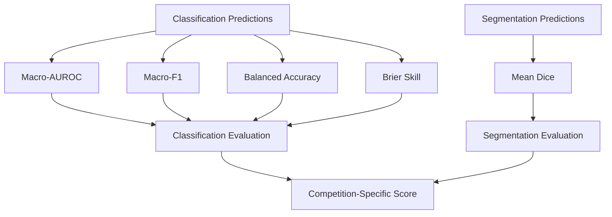

The competition score may combine metrics and subgroup scores. The official formula should be implemented exactly rather than replaced with an assumed average.

---

## 5. Data Leakage Prevention

Data leakage occurs when information from validation or test data influences training in a way that would not be available during real prediction.

This is especially important when multiple images originate from the same patient or lesion.

The project should:

* Keep related images in the same data split when the competition requires group-based separation.
* Fit preprocessing and feature-selection steps on training data only.
* Avoid tuning the model using the hidden test labels.
* Generate validation predictions without training on the corresponding validation targets.
* Keep the test submission aligned with the original test identifiers.

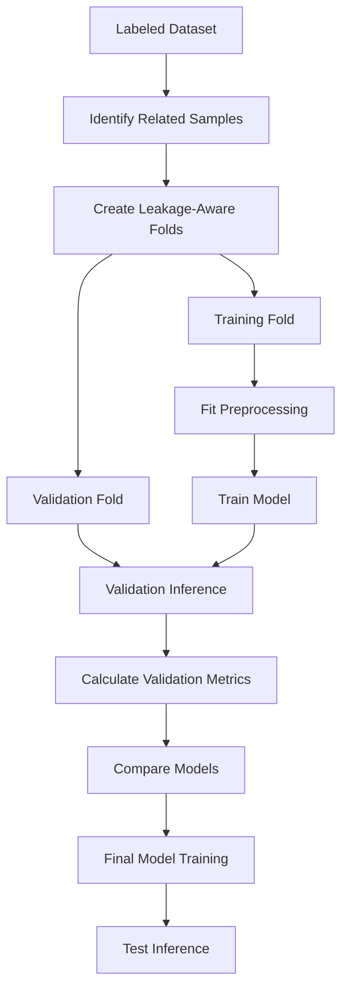

---

## 6. Submission Generation and Validation

A model is not complete until its predictions are converted into a valid submission file.

Each task has its own output requirements, so submission generation should be handled independently before any final assembly.

### River submission

* Correct number of prediction rows.
* Required quantile columns and order.
* No missing or infinite predictions.
* Correct row ordering and identifiers.
* No invalid quantile crossings, where applicable.

### Breast cancer submission

* Correct number of submission rows.
* Correct identifiers for each image and task.
* Three valid classification probabilities per image, represented according to the competition format.
* Probability sums consistent with the expected format.
* Correct mask encoding.
* No missing predictions unless explicitly permitted by the specification.

### Validation architecture

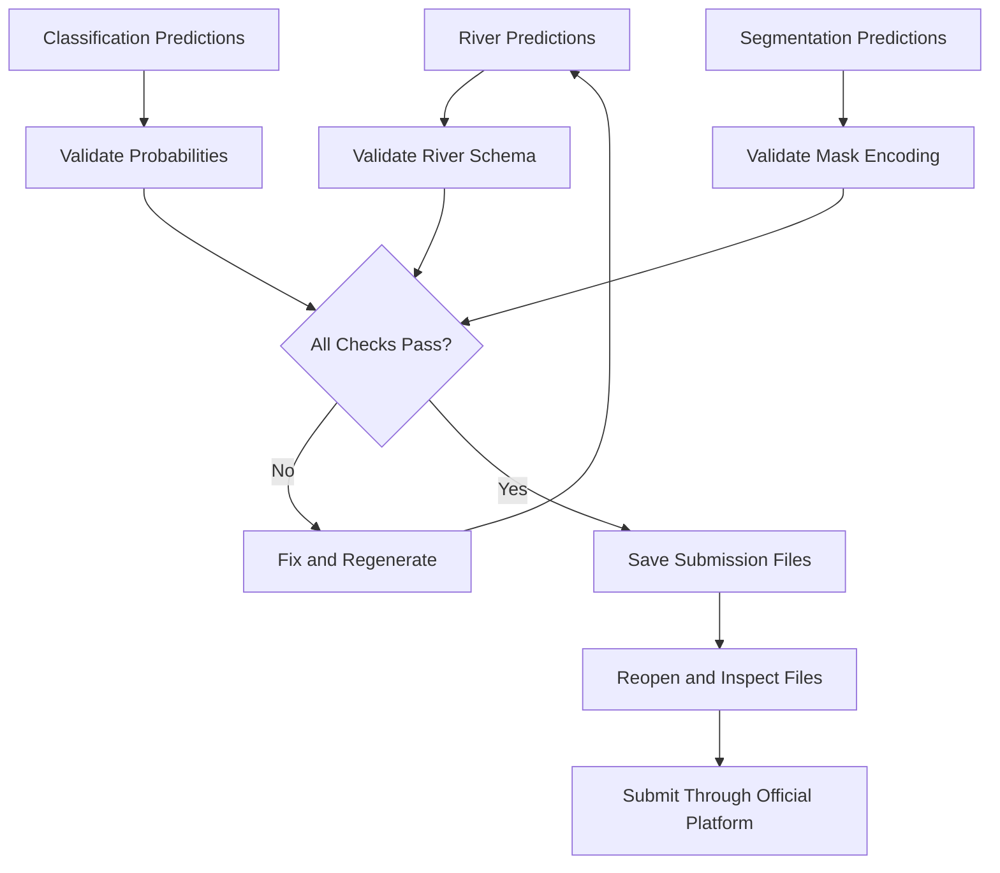

Never overwrite a known-good submission until the new file has passed validation.

---

## 7. Suggested Repository Structure

```text
river-breast-cancer-ai/
│
├── README.md
│
├── river/
│   ├── data/
│   ├── notebooks/
│   ├── src/
│   │   ├── preprocessing.py
│   │   ├── features.py
│   │   ├── train_c1.py
│   │   ├── train_c2.py
│   │   ├── evaluate.py
│   │   └── predict.py
│   └── submissions/
│
├── breast_cancer/
│   ├── data/
│   ├── notebooks/
│   ├── src/
│   │   ├── preprocessing.py
│   │   ├── classification.py
│   │   ├── segmentation.py
│   │   ├── evaluate.py
│   │   ├── encode_masks.py
│   │   └── predict.py
│   └── submissions/
│
├── shared/
│   └── submission_validation.py
│
├── requirements.txt
└── .gitignore
```

This is a proposed organization, not a claim that these files already exist. The competition datasets should not be committed to a public repository unless their licensing and competition rules permit it.

---

## 8. Reproducibility and Experiment Tracking

Every experiment should record:

* Model type and configuration.
* Feature extraction and preprocessing settings.
* Training and validation split.
* Random seed.
* Validation metrics.
* Training duration.
* Output submission filename.
* Known limitations.

Suggested experiment naming:

```text
river_c1_baseline
river_c1_quantile_v2
breast_classification_baseline
breast_classification_v2
breast_segmentation_unet
```

Maintain separate submission files so that improvements can be compared without losing the best known result.

---

## 9. Current Limitations and Future Work

### River forecasting

* Compare quantile models against the baseline using the official validation metric.
* Improve feature engineering where justified by the available data.
* Evaluate performance across different temporal periods.
* Investigate quantile crossing and calibration.
* Document the exact C2 task and model.

### Breast cancer

* Improve recognition of the minority `normal` class.
* Compare feature-based models with stronger image models.
* Evaluate classification probabilities and calibration.
* Improve segmentation quality using appropriate validation metrics.
* Verify RLE decoding and reconstruction visually.
* Compare all experiments using the official competition scoring procedure.

Model complexity should be increased only when it produces a measurable improvement under the competition's evaluation protocol.

---

## 10. End-to-End System Architecture

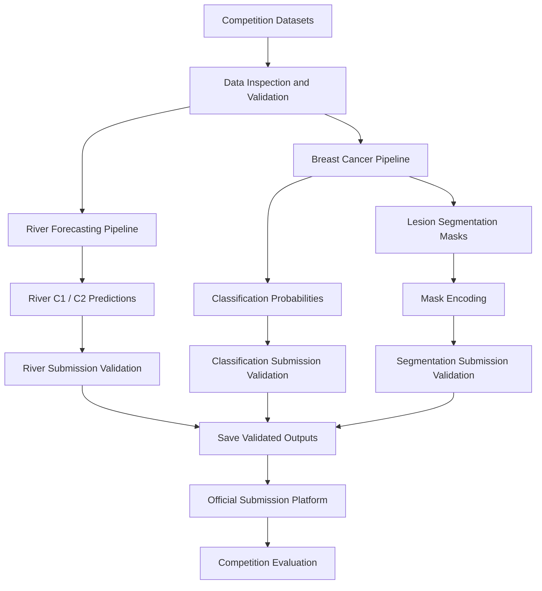

## 11. Conclusion

This project combines two distinct applications of machine learning:

* **River forecasting** focuses on numerical prediction and uncertainty estimation.
* **Breast cancer analysis** combines multiclass image classification with pixel-level lesion segmentation.

The overall workflow emphasizes careful preprocessing, leakage-aware validation, appropriate metrics, correct submission formatting, and reproducible experiments.

The final objective is not simply to train a model, but to build a complete and verifiable prediction pipeline for each task.

---

**Project status:** Experimental.

**Frameworks and libraries:** Python, pandas, NumPy, scikit-learn, and PyTorch where applicable.

**Data and model details:** Update the dataset descriptions, model configurations, validation results, and official scoring formulas to match the final competition implementation.

          
