# 🌊🩺 التنبؤ بجريان الأنهار والذكاء الاصطناعي لسرطان الثدي (River Forecasting & Breast Cancer AI)

> مشروع لمسابقة ذكاء اصطناعي يجمع بين التنبؤ بجريان مياه الأنهار، وتصنيف الصور الطبية، وتقسيم آفات الأورام (Lesion Segmentation).

## 1. نظرة عامة على المشروع (Project Overview)

يعالج هذا المشروع مسألتين مستقلتين في مجال تعلم الآلة (Machine Learning):

1. **التنبؤ ببيانات نهر الراين (Rhine River Forecasting):** التنبؤ بالقيم والمتغيرات المستهدفة المرتبطة بجريان النهر بناءً على البيانات التاريخية والمدخلات المتاحة، بما في ذلك التنبؤات الاحتمالية عند شرائح مئوية متعددة (Quantiles).
2. **تحليل سرطان الثدي (Breast Cancer Analysis):** تحليل صور الموجات فوق الصوتية للثدي (Ultrasound Images) لتصنيفها إلى ثلاث فئات: `طبيعي` (normal)، أو `حميد` (benign)، أو `خبيث` (malignant)، وتحديد مواضع وأبعاد الأورام والآفات عبر تقسيم الصور (Image Segmentation).

تعتمد المسألتان على مجموعات بيانات مختلفة، وخطوط معالجة مسبقة وتدفق بيانات (Preprocessing Pipelines) مستقلة، وبنى نماذج (Model Architectures) متباينة، وإجراءات تقييم منفصلة. ومع ذلك، تشتركان في هدف موحد: استخراج تنبؤات واستدلالات دقيقة وموثوقة تلتزم بصيغة التسليم ومعايير التقييم الرسمية للمسابقة.

### هيكلية المسابقة (Competition Structure)

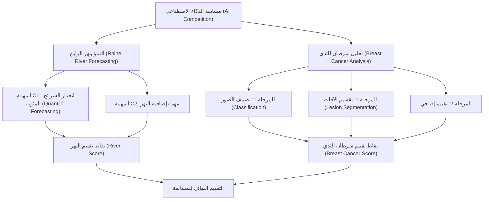

*ملاحظة: يجب توثيق التفاصيل الدقيقة لتنفيذ المهمة C2 والمرحلة الثانية وفقاً للمواصفات النهائية المعتمدة للمسابقة.*

---

## 2. المسألة الأولى — التنبؤ بنهر الراين (Rhine River Forecasting)

### 2.1 صياغة المسألة (Problem Statement)

يُعد التنبؤ بجريان النهر مهمة نمذجة تنبؤية (Predictive Modelling) يتعلم فيها النموذج العلاقات الرياضية والإحصائية بين الملاحظات المتاحة والقيم المستهدفة المستقبلية غير المرصودة.

يكمن التحدي الجوهري في إنتاج تنبؤات تحافظ على دقتها عبر مختلف الظروف والتقلبات الزمنية، بدلاً من الاكتفاء بتقليل متوسط الخطأ العام فقط.

في مهمة التنبؤ C1، يُنتج خط المعالجة تنبؤات لنحو 9,400 صف في مجموعة الاختبار (Test Set)، مع استخراج تنبؤات لأربع شرائح مئوية مطلوبة لكل صف.

### 2.2 الحل المقترح (Proposed Solution)

يمر خط تدفق البيانات والنماذج (Forecasting Pipeline) بالمراحل التالية:

1. تحميل مجموعتي بيانات التدريب (Training Set) والاختبار (Test Set).
2. فحص ومعاينة أنواع الأعمدة، ومعالجة البيانات المفقودة (Missing Values / Imputation)، وتوزيعات القيم المستهدفة، والمتغيرات المرتبطة بالزمن.
3. فصل ميزات المدخلات (Input Features) عن القيم المستهدفة (Target Values).
4. بناء مجموعات بيانات التدريب والتحقق من الصحة (Validation Set) باستخدام تقسيم زمني يحافظ على البنية التسلسلية للبيانات.
5. تدريب نماذج انحدار الشرائح المئوية (Quantile Regression Models).
6. تقييم خطأ التحقق والتحقق من الترتيب المنطقي للشرائح المئوية المتوقعة (عدم حدوث تداخل أو تقاطع بينها).
7. توليد التنبؤات لجميع صفوف مجموعة الاختبار.
8. تجميع ملف التسليم المطلوب والتأكد من مطابقة بنيته للمواصفات.

### البنية المعمارية لنموذج التنبؤ بالنهر

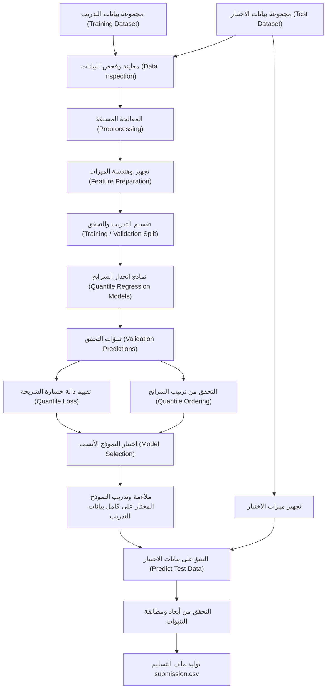

### 2.3 انحدار الشرائح المئوية (Quantile Regression)

على عكس الانحدار العادي (Ordinary Regression) الذي يتنبأ بتقدير نقطي وسطي واحد، يتنبأ انحدار الشرائح المئوية بنقاط ومواضع مختلفة في التوزيع الاحتمالي للهدف (Target Distribution).

على سبيل المثال:
* تمثل الشريحة المئوية الدنيا نتيجة تنبؤية أدنى (حد أدنى محتمل).
* تمثل الشريحة المئوية المتوسطة النتيجة التنبؤية المركزية (الوسيط).
* تمثل الشريحة المئوية العليا نتيجة تنبؤية عليا (حد أعلى محتمل).

بالنسبة لمستوى شريحة مئوية \(q\)، تُعرّف دالة خسارة الكرة والدبابيس (Pinball Loss) الرياضية كما يلي:

$$
L_q(y,\hat y)=
\begin{cases}
q(y-\hat y), & y\geq \hat y\\
(1-q)(\hat y-y), & y<\hat y
\end{cases}
$$

حيث تمثل \(y\) القيمة الحقيقية المرصودة، بينما تمثل \(\hat y\) الشريحة المئوية المتوقعة.

تفرض دالة الخسارة هذه عقوبة غير متماثلة على نقص التقدير مقارنة بالإفراط في التقدير، وذلك بحسب مستوى الشريحة المئوية المطلوبة.

### مسار عمل التنبؤ بالشرائح المئوية

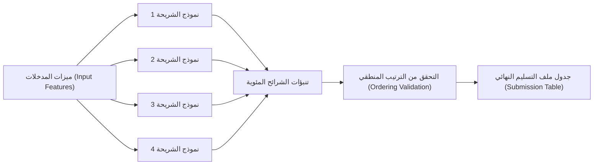

يجب أن تتطابق مستويات الشرائح المئوية الأربعة تماماً مع المستويات المحددة في لوائح المسابقة. كما يجب فحص التنبؤات لمنع مشكلة "تقاطع الشرائح" (Quantile Crossing)، وهي الحالة التي تتجاوز فيها قيمة شريحة مئوية دنيا قيمة شريحة مئوية أعلى منها.

### 2.4 تقييم نموذج النهر (River Model Evaluation)

يجب أن تشمل إجراءات التقييم والفحص ما يلي:

* دالة خسارة الشريحة المئوية أثناء مرحلة التحقق (Validation Quantile Loss).
* قياس أداء النموذج عبر مختلف الفترات الزمنية والظروف المتغيرة لمناسيب النهر.
* رصد ومعالجة أي قيم مفقودة أو غير منتهية (NaN / Infinite Values) في مخرجات التنبؤ.
* رصد أي تقاطع أو تداخل غير منطقي بين الشرائح المئوية (Quantile Crossing).
* دراسة توزيع التنبؤات والتعامل مع القيم الشاذة والمتطرفة (Outliers).
* التحقق من المحاذاة الدقيقة لترتيب الصفوف والمعرفات بين مجموعة الاختبار وملف التسليم.

يجب أن يعكس التحقق من الصحة (Validation) سياق التنبؤ الحقيقي؛ فبالنسبة للبيانات الزمنية والمتسلسلة، يُعتبر التقسيم الزمني الترتيبي (Chronological Split) أكثر ملاءمة وصحة من التقسيم العشوائي (Random Split).

### 2.5 امتداد المهمة C2

لم تُفصل المتغيرات المستهدفة ونموذج المهمة C2 في هذا الملف، وستتم كتابة وتوثيق خطواتها المستقلة فور اعتماد التعريف النهائي للمهمة.

البنية المعمارية المخططة للمهمة C2:

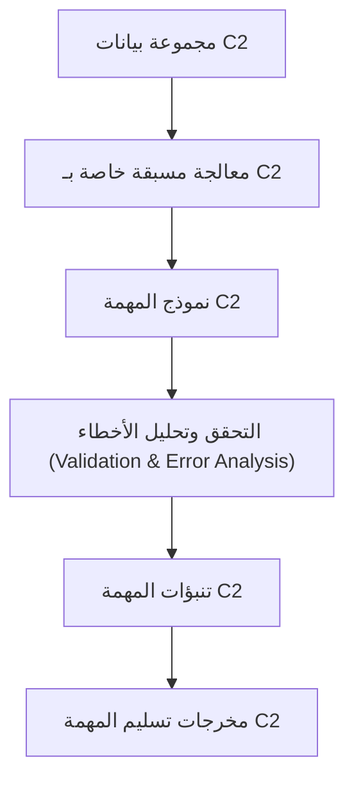

---

## 3. المسألة الثانية — تحليل سرطان الثدي (Breast Cancer Analysis)

### 3.1 صياغة المسألة (Problem Statement)

تحتوي صور الموجات فوق الصوتية للثدي على أنماط بصرية تساعد في التمييز بين الأنسجة السليمة الطبيعية، والكتل الحميدة، والأورام الخبيثة.

تتضمن هذه المسألة هدفين متكاملين:

**التصنيف (Classification):** تقدير احتمالية انتماء الصورة إلى كل فئة من الفئات الثلاث.

**تقسيم الصور (Segmentation):** التنبؤ بالموقع الجغرافي المكاني لآفة الورم وتمثيله عبر قناع ثنائي (Binary Mask).

يجيب التصنيف عن سؤال: *إلى أي فئة تنتمي هذه الصورة؟* بينما يجيب تقسيم الصور عن سؤال: *أين يقع الورم بدقة داخل الصورة؟*

### 3.2 فئات التصنيف (Classification Labels)

| الفئة (Class) | المعنى والدلالة الطبية |
| :--- | :--- |
| `normal` | طبيعي - لم يتم رصد أي آفات أو أورام |
| `benign` | حميد - ورم أو آفة حميدة |
| `malignant` | خبيث - ورم أو آفة خبيثة |

يُخرج نموذج التصنيف ثلاثة احتمالات لكل صورة:

$$
P(\text{normal})+
P(\text{benign})+
P(\text{malignant})=1
$$

يجب ربط هذه الاحتمالات بدقة بالمعرفات المحددة للصور وأعمدة الفئات المطلوبة في لوائح المسابقة.

### 3.3 البنية المعمارية لتحليل سرطان الثدي

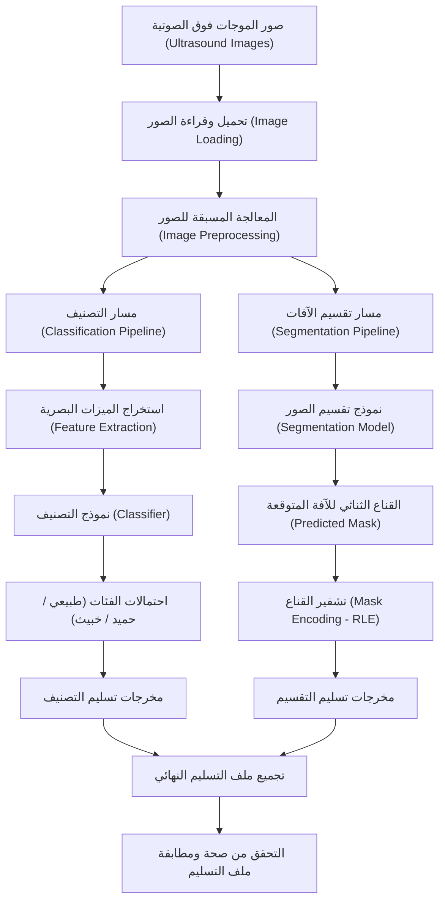

### 3.4 حل مسألة التصنيف (Classification Solution)

تعتمد التجارب الحالية للتصنيف على استخراج ميزات رقمية وهندسية من الصور واستخدام خط أنابيب لتعلم الآلة الكلاسيكي (Classical Machine Learning Pipeline).

يتلخص مسار العمل في الخطوات التالية:

1. تحميل البيانات الوصفية (Metadata) وتسميات الصور (Labels).
2. استخراج الميزات العددية (Numerical Feature Extraction) من صور الموجات فوق الصوتية.
3. إنشاء أجزاء التدريب والتحقق المتقاطع (Cross-Validation Folds).
4. تدريب مصنف متعدد الفئات (Multiclass Classifier).
5. توليد تنبؤات التحقق خارج الأجزاء (Out-of-Fold Predictions) لتقييم النموذج بموضوعية.
6. استنتاج احتمالات الفئات لصور مجموعة الاختبار.
7. ربط الاحتمالات بالترتيب المعتمد للفئات وبالمعرفات الرسمية للتسليم.

ترتيب الفئات المعتمد في التجارب الحالية:

```text
0 = normal (طبيعي)
1 = benign (حميد)
2 = malignant (خبيث)
```

يجب الحفاظ على هذا الترتيب والتوافق طوال مراحل التدريب والتحقق وتوليد ملف التسليم.

### مسار عمل التصنيف

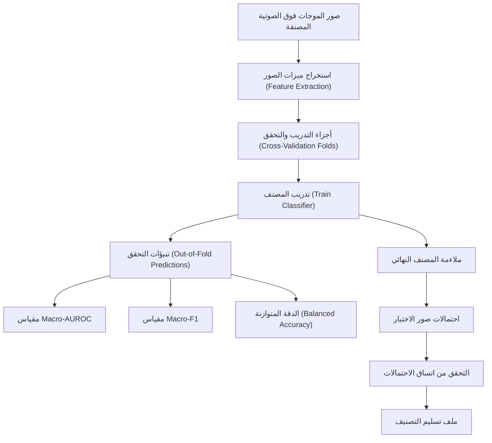

يجب تقييم نموذج التصنيف باستخدام معايير تقييم تعكس أداء الفئات الثلاث بالتساوي؛ فالدقة العامة (Accuracy) وحدها قد تخفي ضعف الأداء على الفئات الأقل تمثيلاً (Minority Classes).

### 3.5 حل مسألة تقسيم الآفات (Lesion Segmentation Solution)

يُعد تقسيم الصور مهمة تنبؤ على مستوى البكسل (Pixel-Level Prediction)، حيث ينتج النموذج قناعاً يحدد لكل بكسل ما إذا كان ينتمي إلى الورم أم لا.

يتلخص مسار العمل العام في:

1. تحميل صور التدريب وأقنعة الحقيقة الأرضية المرجعية (Ground-Truth Masks).
2. تطبيق معالجة مسبقة متسقة للصور والأقنعة.
3. تدريب نموذج تقسيم الصور باستخدام الأزواج المتطابقة من الصور والأقنعة.
4. توليد الأقنعة لصور الاختبار عبر الاستدلال (Inference).
5. تحويل الأقنعة المتوقعة إلى الصيغة المشفرة المطلوبة في المسابقة.
6. التحقق من سلامة الأقنعة المشفرة قبل إدراجها في ملف التسليم.

يُعد استخدام بنية معمارية مستوحاة من شبكات U-Net أحد الأساليب الفعالة والمعتمدة في هذا السياق.

### البنية المعمارية لشبكة التقسيم بنمط U-Net

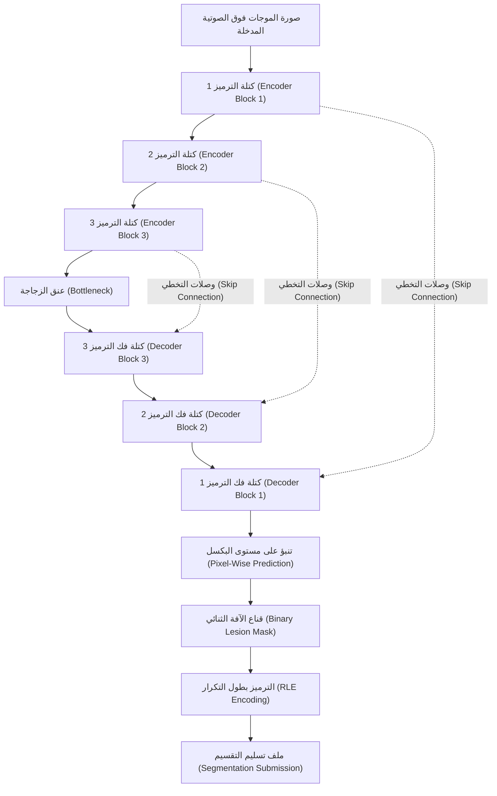

يقوم قسم الترميز (Encoder) باستخراج ميزات بصرية مجردة وعميقة تدريجياً، بينما يتولى قسم فك الترميز (Decoder) إعادة بناء المعلومات المكانية والتفاصيل الدقيقة. وتعمل وصلات التخطي (Skip Connections) على نقل التفاصيل الهندسية ومواضع الحواف مباشرة للمساعدة في تحديد حدود الورم بدقة عالية.

**هام:** يوضح هذا المخطط البنية المعمارية لنمط U-Net المستهدف؛ ويجب التحقق من تطابق النموذج المستخدم فعلياً في أي تجربة مع كود التنفيذ البرمجي.

### 3.6 الترميز بطول التكرار (Run-Length Encoding - RLE)

تتطلب بعض مسابقات تقسيم الصور تقديم الأقنعة في هيئة سلاسل مشفرة بطول التكرار (RLE) بدلاً من حفظها كملفات صور منفصلة، وذلك لتوفير المساحة وتسهيل التقييم.

يمثل ترميز RLE وحدات البكسل المتتالية التابعة للمنطقة المستهدفة (Foreground) عبر تحديد مواضع بدايتها وأطوال تكرارها.

يجب أن يلتزم إجراء التشفير بدقة باتجاه التسطيح (Flattening Order - صفي أو عمودي)، وقواعد الفهرسة (0-indexed أم 1-indexed)، وأبعاد الصورة المعتمدة في المسابقة.

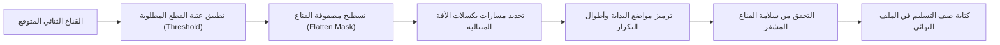

يتطلب تسليم التقسيم الصحيح الحفاظ على معرف الصورة، واستخدام معيار التشفير المطلوب، والتعامل السليم مع الأقنعة الفارغة (التي لا تحتوي على أورام) وفقاً لقواعد المسابقة.

---

## 4. تقييم نموذج سرطان الثدي (Breast Cancer Evaluation)

تُقيّم المسابقة كلاً من التصنيف وتقسيم الصور باستخدام عدة معايير تقييم (Evaluation Metrics) متكاملة:

| المقياس (Metric) | الغرض والهدف منه |
| :--- | :--- |
| **المساحة الكلية تحت منحنى ROC (Macro-AUROC)** | تقييم قدرة النموذج على التمييز بين الفئات مع إعطاء وزن متساوٍ لكل فئة |
| **مقياس F1 الكلي (Macro-F1)** | قياس التوازن بين الدقة المحددة (Precision) والاستدعاء (Recall) عبر جميع الفئات |
| **الدقة المتوازنة (Balanced Accuracy)** | حساب متوسط الاستدعاء (Recall) عبر الفئات المختلفة للحد من تأثير عدم توازن الفئات |
| **متوسط معامل دايس (Mean Dice)** | قياس نسبة التداخل والتشابه بين الأقنعة المتوقعة والأقنعة المرجعية الحقيقية للآفات |
| **مهارة براير (Brier Skill Score)** | تقييم جودة ومعايرة التنبؤات الاحتمالية مقارنة بخط أساس مرجعي |

يجب تنفيذ حساب المقاييس وخطوط الأساس المرجعية وقواعد المجموعات الفرعية بما يتطابق تماماً مع المواصفات الرسمية للمسابقة.

### أهمية الاعتماد على مقاييس تقييم متعددة

قد يحقق النموذج دقة عامة (Overall Accuracy) مرتفعة ظاهرياً، لكنه يعاني من أداء ضعيف جداً على الفئات النادرة أو الأقل تمثيلاً. وبالمثل، قد يُخرج نموذج التقسيم أقنعة دون أن يُحيط بحدود الورم الفعلية بدقة.

لذلك، يجب ألا يقتصر التقييم على النظرة الإجمالية، بل ينبغي تحليل الأداء بالتفصيل عبر الفئات والمجموعات الفرعية المختلفة.

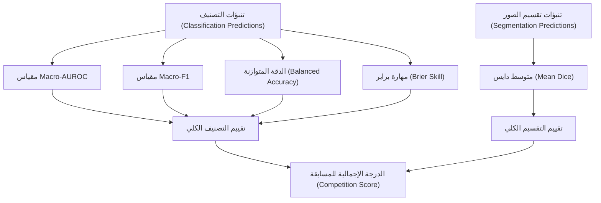

قد تجمع درجة التقييم في المسابقة بين مقاييس متعددة وأوزان للمجموعات الفرعية؛ لذا ينبغي تطبيق المعادلة الرسمية بدقة متناهية وتجنب الاكتفاء بمتوسطات تقديرية.

---

## 5. منع تسريب البيانات (Data Leakage Prevention)

يحدث تسريب البيانات (Data Leakage) عندما تتسلل معلومات من بيانات التحقق أو الاختبار إلى مرحلة التدريب بطريقة غير واقعية لا تتاح أثناء الاستدلال الفعلي (Real-Time Inference).

يكتسب هذا الأمر أهمية بالغة عند وجود صور متعددة تنتمي لنفس المريض أو نفس الآفة المرضية.

لضمان سلامة النموذج، يجب مراعاة ما يلي:

* إبقاء جميع الصور العائدة لنفس المريض في نفس الجزء (Fold) عند تطبيق التقسيم الجماعي (Group-based Split).
* ملاءمة وتطبيق خطوات المعالجة المسبقة (Preprocessing) واختيار الميزات (Feature Selection) حصرياً على بيانات التدريب، ثم تطبيق التحويل فقط على بيانات التحقق والاختبار.
* تجنب ضبط المعلمات الفائقة (Hyperparameters) بناءً على نتائج الاختبار المخفية.
* توليد تنبؤات التحقق دون تدريب النموذج على القيم المستهدفة لنفس عينات التحقق.
* الحفاظ على توافق وتطابق معرفات الاختبار الأصلية مع ملف التسليم.

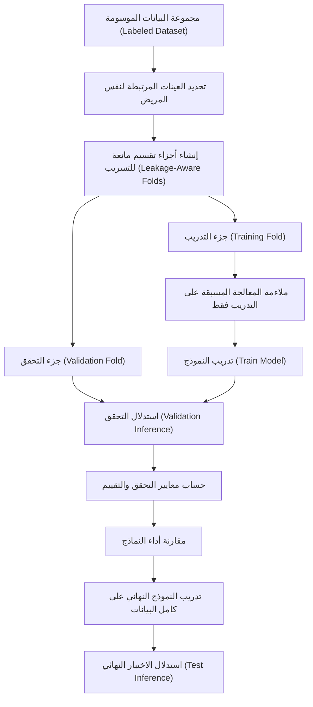

---

## 6. توليد ملفات التسليم والتحقق من صحتها (Submission Generation & Validation)

لا تكتمل دورة عمل النموذج إلا بعد تحويل تنبؤاته واستدلالاته إلى ملف تسليم صالح ومطابق بنسبة 100% للشروط.

لكل مهمة متطلبات إخراج خاصة بها؛ لذا ينبغي توليد والتحقق من صحة مخرجات كل مهمة على حدة قبل دمجها في التسليم النهائي.

### متطلبات تسليم بيانات النهر:

* مطابقة العدد الإجمالي لصفوف التنبؤ لبيانات الاختبار.
* صحة وترتيب أعمدة الشرائح المئوية المطلوبة.
* خلو التنبؤات تماماً من القيم المفقودة (NaN) أو غير المنتهية (Inf).
* صحة المعرفات والترتيب التسلسلي للصفوف.
* سلامة الشرائح المئوية من أي تقاطعات غير منطقية (Quantile Crossing).

### متطلبات تسليم سرطان الثدي:

* مطابقة العدد الصحيح لصفوف التسليم.
* صحة المعرفات لكل صورة ومهمة تابعة لها.
* وجود ثلاث احتمالات تصنيف صالحة لكل صورة وفق تنسيق المسابقة المعتمد.
* اتساق مجموع الاحتمالات مع التنسيق المطلوب (مجموعها يساوي 1).
* صحة تشفير أقنعة الآفات بصيغة RLE.
* عدم وجود أي تنبؤات مفقودة ما لم تنص تعليمات المسابقة على جواز ذلك.

### معمارية التحقق من ملف التسليم (Validation Architecture)

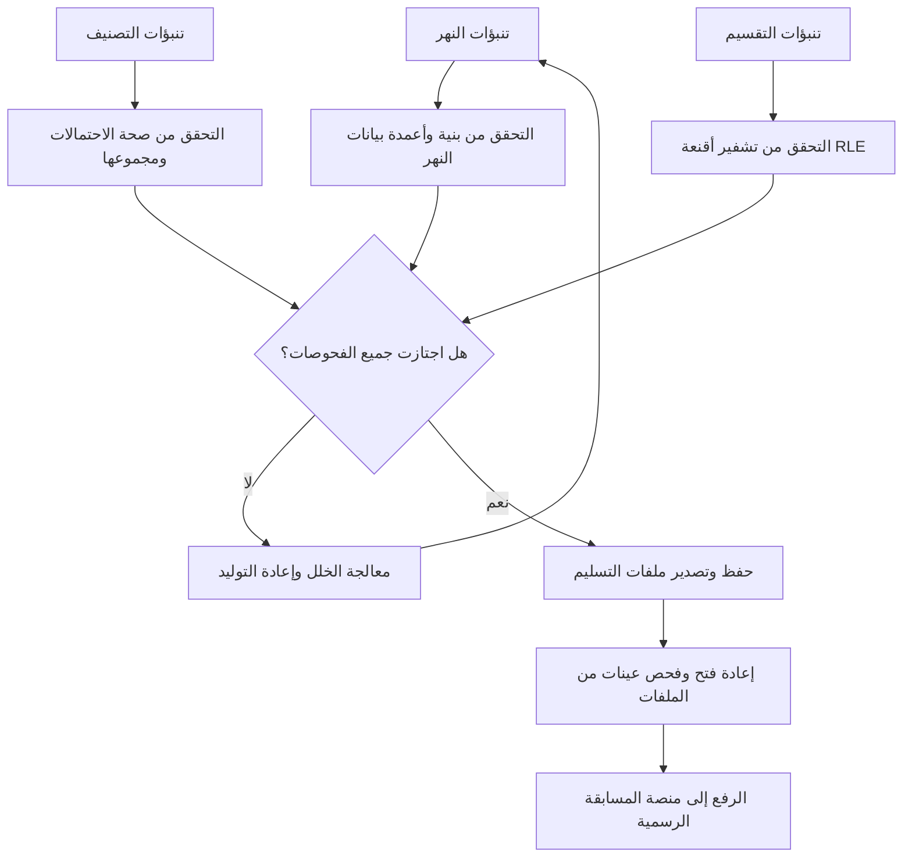

يُمنع استبدال ملف تسليم سليم ومعتمد مسبقاً بنسخة جديدة قبل أن يجتاز الملف الجديد جميع اختبارات التحقق من الصحة بنجاح.

---

## 7. الهيكلية المقترحة لمستودع المشروع (Suggested Repository Structure)

```text
river-breast-cancer-ai/
│
├── README.md
├── README_ar.md
│
├── river/
│   ├── data/
│   ├── notebooks/
│   ├── src/
│   │   ├── preprocessing.py
│   │   ├── features.py
│   │   ├── train_c1.py
│   │   ├── train_c2.py
│   │   ├── evaluate.py
│   │   └── predict.py
│   └── submissions/
│
├── breast_cancer/
│   ├── data/
│   ├── notebooks/
│   ├── src/
│   │   ├── preprocessing.py
│   │   ├── classification.py
│   │   ├── segmentation.py
│   │   ├── evaluate.py
│   │   ├── encode_masks.py
│   │   └── predict.py
│   └── submissions/
│
├── shared/
│   └── submission_validation.py
│
├── requirements.txt
└── .gitignore
```

هذه الهيكلية تمثل مقترحاً تنظيمياً لتنسيق الكود والمشروع. لا ينبغي رفع مجموعات بيانات المسابقة إلى مستودعات عامة ما لم تسمح تراخيص المسابقة وشروطها بذلك صراحة.

---

## 8. قابلية إعادة الإنتاج وتتبع التجارب (Reproducibility & Experiment Tracking)

يجب تسجيل وتوثيق معطيات كل تجربة تدريب بدقة:

* نوع النموذج وبنيته المعمارية وإعداداته (Model Configuration).
* إعدادات استخراج وهندسة الميزات والمعالجة المسبقة.
* تفاصيل تقسيم التدريب والتحقق من الصحة (Train/Validation Split).
* البذرة العشوائية (Random Seed) لتثبيت العشوائية.
* معايير ومقاييس التحقق المحققة (Validation Metrics).
* وقت ومدة التدريب الحاسوبي.
* اسم ومسار ملف التسليم الناتج.
* أي قيود أو ملاحظات معروفة ظهرت أثناء التجربة.

نمط مقترح لتسمية التجارب:

```text
river_c1_baseline
river_c1_quantile_v2
breast_classification_baseline
breast_classification_v2
breast_segmentation_unet
```

يُنصح بحفظ ملفات التسليم السابقة بشكل منفصل لتسهيل المقارنة بين التجارب دون فقدان أفضل نتيجة تم التوصل إليها سابقاً.

---

## 9. القيود الحالية والخطوات المستقبلية (Current Limitations & Future Work)

### التنبؤ بجريان النهر (River Forecasting):

* مقارنة نماذج انحدار الشرائح بنموذج خط الأساس (Baseline) باستخدام مقياس التقييم الرسمي.
* تحسين هندسة الميزات (Feature Engineering) بما يتلاءم مع طبيعة البيانات المتاحة.
* تقييم أداء النموذج عبر فترات زمنية ومواسم مختلفة.
* فحص وضبط تقاطع الشرائح المئوية ومعايرتها الإحصائية.
* توثيق تفاصيل ونموذج المهمة C2 بشكل كامل فور تأكيد متطلباتها.

### تحليل سرطان الثدي (Breast Cancer):

* تحسين دقة التعرف على فئة الصور السليمة `normal` ذات التمثيل الأقل.
* مقارنة النماذج القائمة على الميزات اليدوية بنماذج التعلم العميق المتقدمة للرؤية الحاسوبية (Computer Vision & Deep Learning).
* تقييم دقة احتمالات التصنيف ومعايرتها (Probability Calibration).
* رفع جودة تقسيم الصور باستخدام دوال خسارة ومقاييس تقييم متخصصة (مثل Dice Loss).
* فحص وفك تشفير أقنعة RLE للتأكد بصرياً من تطابقها مع الصور الأصلية.
* مقارنة كافة التجارب وفق بروتوكول التقييم الرسمي للمسابقة.

لا ينبغي زيادة تعقيد النموذج إلا عندما يؤدي ذلك إلى تحسن حقيقي وملموس وفق معايير التقييم المعتمدة في المسابقة.

---

## 10. البنية المعمارية الشاملة للنظام (End-to-End System Architecture)

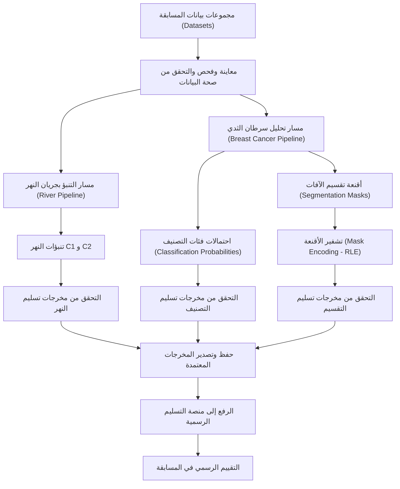

## 11. الخاتمة (Conclusion)

يجمع هذا المشروع بين تطبيقين بارزين ومتمايزين في علم تعلم الآلة:

* **التنبؤ بجريان النهر:** يركز على الانحدار والتنبؤ العددي وتقدير عدم اليقين (Uncertainty Estimation).
* **تحليل سرطان الثدي:** يجمع بين التصنيف متعدد الفئات للصور الطبية وتقسيم آفات الأورام على مستوى البكسل.

يرتكز سير العمل على المعالجة المسبقة الدقيقة للبيانات، والتحقق المانع لتسريب البيانات، واختيار المقاييس الملائمة، وضمان الصياغة المعتمدة للتسليم، وقابلية إعادة إنتاج التجارب.

الهدف الأساسي ليس مجرد تدريب نموذج، بل بناء خط متكامل وموثوق للتحليل والاستدلال والتنبؤ لكل مسألة.

---

**حالة المشروع (Project Status):** تجريبي (Experimental).

**أطر العمل والمكتبات البرمجية (Frameworks & Libraries):** بايثون (Python)، وبانداس (pandas)، وNumPy، وscikit-learn، وPyTorch عند الحاجة.

**تفاصيل البيانات والنماذج:** يُرجى تحديث توصيفات البيانات، وإعدادات النماذج، ونتائج التحقق، وصيغ التقييم المعتمدة بما يتطابق تماماً مع المواصفات الرسمية للمسابقة.

